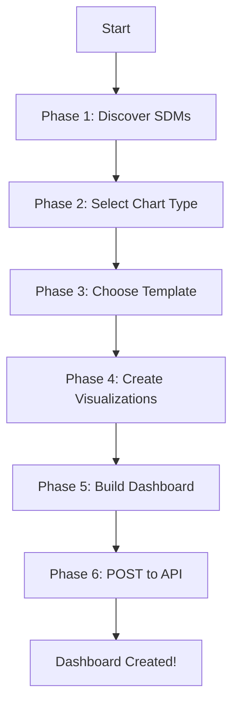

# Dashboard Creation Workflow

> **Back to main skill:** [SKILL.md](SKILL.md)

**CRITICAL**: When creating dashboards, ALWAYS follow this workflow in order. Templates are MANDATORY for both visualizations and dashboards.

## Overview

This workflow ensures you discover available data, select appropriate chart types, use production-quality templates, and create dashboards that comply with the Tableau Next API.



## Phase 1: Discover Available SDMs

**Goal:** List all available Semantic Data Models and understand what data is available.

### List All SDMs

**Via Script:**
```bash
python scripts/discover_sdm.py --list
```

**Via API:**
```bash
curl -X GET \
  "${SF_INSTANCE}/services/data/v66.0/ssot/semantic/models" \
  -H "Authorization: Bearer ${SF_TOKEN}" \
  -H "Content-Type: application/json"
```

**Response Structure:**
```json
{
  "semantic_models": [
    {
      "id": "sdm_12345",
      "apiName": "Sales_Analytics_Model",
      "label": "Sales Analytics",
      "description": "Complete sales performance metrics",
      "dataspace": "default"
    }
  ]
}
```

**What to extract:** SDM `apiName` for next steps

### Get Detailed SDM Definition

**Via Script:**
```bash
python scripts/discover_sdm.py --sdm {{SDM_NAME}} --json
```

**Via API:**
```bash
curl -X GET \
  "${SF_INSTANCE}/services/data/v66.0/ssot/semantic/models/{{SDM_NAME}}" \
  -H "Authorization: Bearer ${SF_TOKEN}"
```

**Response Structure:**
```json
{
  "apiName": "Sales_Analytics_Model",
  "label": "Sales Analytics",
  "semanticDataObjects": [
    {
      "apiName": "Opportunity",
      "label": "Opportunities",
      "semanticDimensions": [
        {"apiName": "Region", "label": "Region", "dataType": "Text"},
        {"apiName": "Close_Date", "dataType": "DateTime"}
      ],
      "semanticMeasurements": [
        {"apiName": "Amount", "label": "Amount", "aggregationType": "Sum"}
      ]
    }
  ],
  "semanticCalculatedMeasurements": [
    {"apiName": "Total_Sales_clc", "label": "Total Sales", "aggregationType": "Sum"},
    {"apiName": "Win_Rate_clc", "label": "Win Rate", "aggregationType": "UserAgg"}
  ],
  "semanticCalculatedDimensions": [
    {"apiName": "Days_to_Close_Bucket_clc", "label": "Days to Close (Bucket)", "dataType": "Text"}
  ]
}
```

**What to extract:**
- **Data objects**: `semanticDataObjects[].apiName` (e.g., "Opportunity")
- **Dimensions** (for grouping): `semanticDimensions[]` → text, date fields
- **Measures** (for aggregation): `semanticMeasurements[]` → numeric fields with `aggregationType`
- **Calculated measures**: `semanticCalculatedMeasurements[]` → use `aggregationType` directly as `function`
- **Calculated dimensions**: `semanticCalculatedDimensions[]` → text/boolean fields with `_clc` suffix

**Key:** `semanticCalculatedMeasurements[].aggregationType` is the exact value to use as `function` in field definitions. Never assume `"Sum"` — always read it from the SDM.

## Phase 2: Select Chart Type

**Goal:** Choose the appropriate chart type based on your data pattern and visualization goal.

Use the decision matrix from [templates-guide.md](templates-guide.md) to select the right chart type:

| Data Pattern | Field Combination | Recommended Chart Type | Template |
|--------------|------------------|----------------------|----------|
| **Trend over time** | 1 Date Dimension + 1 Measure | Line Chart | `trend_over_time` |
| **Multi-series trend** | 1 Date Dimension + 1 Measure + 1 Dimension | Multi-Series Line Chart | `multi_series_line` |
| **Comparison/Ranking** | 1 String Dimension + 1 Measure | Horizontal Bar Chart (sorted descending) | `revenue_by_category` |
| **Part-to-Whole (< 5 values)** | 1 Dimension (< 5 unique values) + 1 Measure | Donut Chart | `market_share_donut` |
| **Part-to-Whole (≥ 5 values)** | 1 Dimension (≥ 5 unique values) + 1 Measure | Stacked Bar Chart | `stacked_bar_by_dimension` |
| **Part-to-Whole with Breakdown** | 2 Dimensions + 1 Measure | Stacked Bar Chart | `stacked_bar_by_dimension` |
| **Two-dimensional analysis** | 2 Dimensions + 2 Measures | Dot Matrix | `dot_matrix` |
| **Correlation** | 2 Continuous Measures | Scatter Plot | `scatter_correlation` |
| **Funnel/Stage Analysis** | 1 Stage Dimension + 1 Measure | Funnel Chart | `conversion_funnel` |
| **Heatmap** | 2 Dimensions + 1 Measure | Heatmap | `heatmap_grid` |
| **Detailed Table** | Multiple Dimensions + Measures | Table (sorted) | `top_n_leaderboard` |

**Decision Rules:**
- **Never use Pie Chart** — Use Donut Chart instead (better for < 5 slices)
- **Bar Charts are automatically sorted descending** by measure (templates handle this) + **add color_dim when 2+ dimensions available**
- **Line Charts use Year + Month hierarchy AUTOMATICALLY** — Templates handle this via `date_functions` (DatePartYear + DatePartMonth). No manual configuration needed.
- **Always add color encodings** when multiple dimensions available — Use optional `color_dim` field in templates
- **Date Dimensions** → Always use Line Chart for trends (prefer `multi_series_line` with `color_dim` if dimension available)
- **Stage/Status fields** → Prefer Bar Chart over Funnel (bar charts are more versatile)
- **2 Measures** → Use Scatter Plot with Detail + Color encodings to show correlation

See [templates-guide.md](templates-guide.md) for the complete decision matrix with examples.

## Phase 3: Choose Template

**Goal:** Select the appropriate visualization template or use auto-select.

### Option 1: Auto-Select Chart Type (Recommended)

The system can automatically detect your data pattern and select the appropriate template:

```bash
python scripts/apply_viz_template.py \
  --sdm Sales_Model \
  --date Close_Date \
  --measure Total_Amount \
  --auto-select \
  --auto-match \
  --name Sales_Trend \
  --workspace My_Workspace \
  --post
```

The system will automatically detect "1 Date Dimension + 1 Measure" and select `trend_over_time` template (Line Chart). If a dimension is also available, it will prefer `multi_series_line` with color_dim for better visualization.

**With color encoding:**
```bash
python scripts/apply_viz_template.py \
  --template revenue_by_category \
  --sdm Sales_Model \
  --category Region \
  --amount Total_Amount \
  --color-dim Opportunity_Type \
  --name Revenue_by_Region \
  --workspace My_Workspace \
  --post
```

This adds Color encoding + legend automatically (test harness pattern).

### Option 2: Explicit Template Selection

**List available templates:**
```bash
python scripts/apply_viz_template.py --list-templates
```

**Preview template requirements:**
```bash
python scripts/apply_viz_template.py --preview revenue_by_category
```

**Create from template:**
```bash
python scripts/apply_viz_template.py \
  --template revenue_by_category \
  --sdm Sales_Model \
  --category Region \
  --amount Total_Amount \
  --name Revenue_by_Region \
  --label "Revenue by Region" \
  --workspace My_Workspace \
  --post
```

**Auto-match fields** (when field names are obvious):
```bash
python scripts/apply_viz_template.py \
  --template revenue_by_category \
  --sdm Sales_Model \
  --auto-match \
  --name Revenue_Bar \
  --workspace My_Workspace \
  --post
```

The template will search for fields like "Amount", "Revenue", "Total", etc. and match them automatically.

See [templates-guide.md](templates-guide.md) for the complete template catalog.

## Phase 4: Create Visualizations

**Goal:** Create all visualizations needed for your dashboard BEFORE creating the dashboard.

**CRITICAL**: Always use visualization templates instead of manually building visualization JSON. Templates ensure proper field structure, encodings, sorting, and API compliance.

### Create Each Visualization

For each visualization needed:
1. Use `apply_viz_template.py` with `--auto-select` and `--auto-match` when possible
2. Or explicitly choose template from [templates-guide.md](templates-guide.md) based on data pattern
3. **NEVER manually build visualization JSON** — always use templates

### Validate Before POSTing

```bash
python scripts/validate_viz.py viz.json
```

### POST Visualization to API

```bash
curl -X POST "${SF_INSTANCE}/services/data/v66.0/tableau/visualizations?minorVersion=8" \
  -H "Authorization: Bearer ${SF_TOKEN}" \
  -H "Content-Type: application/json" \
  -d @viz.json
```

**Response:**
```json
{
  "id": "viz_abc123",
  "name": "Revenue_by_Region",
  "label": "Revenue by Region",
  "url": "https://{instance}.salesforce.com/analytics/visualization/viz_abc123"
}
```

### Note Visualization API Names

**IMPORTANT:** Note the API names (`name` field) of all created visualizations — you'll need these for the dashboard in Phase 5.

## Phase 5: Build Dashboard Using Pattern

**Goal:** Create dashboard JSON using a production-ready pattern that ensures proper layout and API compliance.

**CRITICAL**: Always use dashboard patterns/templates instead of manually building dashboard JSON. Dashboard patterns ensure proper layout, widget structure, and API compliance.

### Choose Dashboard Pattern

Review available dashboard patterns:

1. **`f_layout`** — Metrics in left sidebar, visualizations in F-pattern
   - Best for: Executive dashboards with KPIs prominently displayed
   - **REQUIRES metrics** - Do not use if no metrics available

2. **`z_layout`** — Metrics in top row, visualizations in Z-pattern  
   - Best for: Operational dashboards with metrics at top, OR visualizations-only dashboards
   - **OPTIONAL metrics** - Only pattern that gracefully handles no metrics

3. **`vertical_metrics`** — Full-width metrics stacked vertically, multi-page
   - Best for: Metrics-focused dashboards with many KPIs
   - **REQUIRES metrics** - Designed for metrics only

4. **`horizontal_metrics`** — Metrics in horizontal rows, multi-page
   - Best for: Balanced dashboards with metrics and visualizations
   - **REQUIRES metrics** - Designed for metrics

5. **`performance_overview`** — Large metric left, smaller metrics right, time navigation
   - Best for: Performance dashboards with time-based navigation
   - **REQUIRES metrics** - primary_metric is mandatory

### Auto-Select Pattern (Recommended)

```bash
python scripts/generate_dashboard_pattern.py \
  --auto-select-pattern \
  --name {{DASHBOARD_NAME}} \
  --workspace-name {{WORKSPACE}} \
  --sdm-name {{SDM_NAME}} \
  --viz {{VIZ_1}} {{VIZ_2}} ... \
  --metrics {{METRIC_1}} {{METRIC_2}} ... \
  --filter fieldName={{FIELD}} objectName={{OBJECT}} dataType={{TYPE}} \
  -o dashboard.json
```

Auto-select logic:
- **Metrics + Visualizations** → `f_layout` (metrics left sidebar, vizzes right)
- **Metrics only** → `vertical_metrics` (full-width stacked)
- **Visualizations only** → `z_layout` (only pattern that handles no metrics)

### Explicit Pattern Selection

```bash
python scripts/generate_dashboard_pattern.py \
  --pattern f_layout \
  --name Sales_Dashboard \
  --label "Sales Dashboard" \
  --workspace-name My_WS \
  --sdm-name Sales_Model \
  --title-text "Sales Performance" \
  --metrics Total_Revenue_mtc Win_Rate_mtc \
  --viz Revenue_Bar Pipeline_Funnel \
  --filter fieldName=Account_Industry objectName=Opportunity dataType=Text \
  -o dashboard.json
```

**Pattern-specific arguments:**
- **f_layout/z_layout**: `--title-text "Dashboard Title"`
- **vertical_metrics**: `--metrics-per-page 4 --pages "Page 1" "Page 2"`
- **horizontal_metrics**: `--metrics-per-row 4 --pages "Page 1" "Page 2"`
- **performance_overview**: `--primary-metric Total_Revenue_mtc --secondary-metrics Win_Rate_mtc Pipeline_Count_mtc --pages "Week" "Month" "Day"`

**Reference previously created visualizations by API name** (from Phase 4).

See [templates-guide.md](templates-guide.md) for complete pattern documentation.

## Phase 6: POST Dashboard to API

**Goal:** Create the dashboard in Salesforce.

```bash
curl -X POST "${SF_INSTANCE}/services/data/v66.0/tableau/dashboards?minorVersion=8" \
  -H "Authorization: Bearer ${SF_TOKEN}" \
  -H "Content-Type: application/json" \
  -d @dashboard.json
```

**Response:**
```json
{
  "id": "dash_abc123",
  "name": "Sales_Dashboard",
  "label": "Sales Dashboard",
  "url": "https://{instance}.salesforce.com/analytics/dashboard/dash_abc123"
}
```

## Why This Order Matters

- **SDM First**: Ensures you know what data is available before designing
- **Pattern Selection**: Dashboard layout drives which visualizations are needed
- **Templates Required**: Both visualization and dashboard templates ensure API compliance and quality
- **Visualizations Before Dashboard**: Dashboard references visualization API names, so they must exist first

## Next Steps

- See [templates-guide.md](templates-guide.md) for complete template catalog and decision matrix
- See [scripts-guide.md](scripts-guide.md) for detailed script usage
- See [troubleshooting.md](troubleshooting.md) if you encounter errors
- See [chart-catalog.md](chart-catalog.md) for full JSON templates
